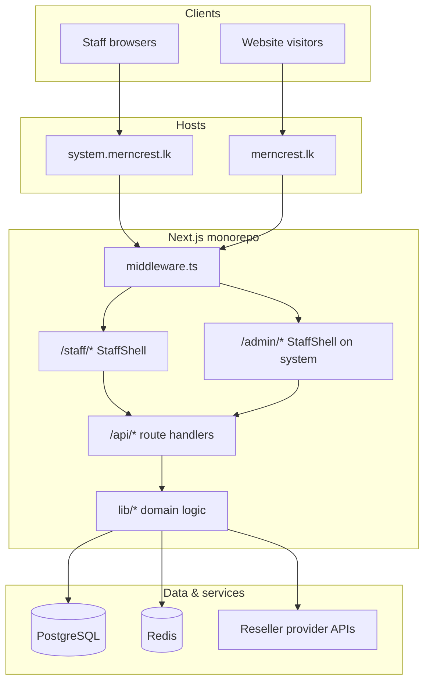

# System.merncrest.lk — Complete A–Z Guide

**MernCrest Solutions · Enterprise Staff Portal**

| Field | Value |
|-------|-------|
| **Production URL** | `https://system.merncrest.lk` |
| **Marketing site** | `https://merncrest.lk` (separate surface — do not mix UI) |
| **Customer portal** | `https://merncrest.lk/portal` |
| **Local dev** | `http://localhost:3000/en/staff?system=1` |
| **Version** | v1 (in-repo) |
| **Last updated** | July 2026 |

---

## Table of contents

1. [Executive summary](#1-executive-summary)
2. [Business context & platform role](#2-business-context--platform-role)
3. [Surfaces & host routing](#3-surfaces--host-routing)
4. [Technology stack](#4-technology-stack)
5. [Architecture overview](#5-architecture-overview)
6. [Design system (Stitch + Figma)](#6-design-system-stitch--figma)
7. [Authentication & security](#7-authentication--security)
8. [Roles, permissions & data scope](#8-roles-permissions--data-scope)
9. [Application shell & navigation](#9-application-shell--navigation)
10. [Module reference (all routes)](#10-module-reference-all-routes)
11. [API surface](#11-api-surface)
12. [Business logic & integrations](#12-business-logic--integrations)
13. [Real-time & live chat](#13-real-time--live-chat)
14. [Data model (Prisma)](#14-data-model-prisma)
15. [ERP on system surface](#15-erp-on-system-surface)
16. [Deployment & infrastructure](#16-deployment--infrastructure)
17. [Local development](#17-local-development)
18. [Module status matrix](#18-module-status-matrix)
19. [Development phases](#19-development-phases)
20. [File & folder map](#20-file--folder-map)
21. [Quality, Git & testing](#21-quality-git--testing)
22. [Anti-patterns (do not do)](#22-anti-patterns-do-not-do)
23. [Related documents](#23-related-documents)

---

## 1. Executive summary

`system.merncrest.lk` is the **Enterprise Staff Portal** for MernCrest Solutions — a single integrated workspace where internal staff manage:

- Employee self-service (ESS): attendance, leave, payslips, performance, training
- CRM & clients, leads, quotations
- Projects, tasks, service delivery
- Finance: invoices, receipts, billing
- Infrastructure ops: domains, DNS, hosting, AWS cloud, monitoring
- Communications: tickets, internal chat, live visitor chat, announcements, notifications
- Command center & analytics
- Full ERP modules (when accessed via `/admin` on the system host)

It is **not** the marketing website and **not** the customer portal. It shares the same Next.js monorepo and PostgreSQL database but uses a dedicated dark **Luminous Enterprise** UI shell (`StaffShell`) and host-based routing.

---

## 2. Business context & platform role

### What MernCrest is

Per platform bible (`PROJECT_DETAILS.md`):

- Primary identity: **Enterprise Technology · Software Development · AI Solutions · Cloud Consulting · Digital Transformation**
- Secondary (reseller only): Domains, Hosting, VPS, SSL, Business Email via **provider marketplace** — MernCrest does not own datacenters

### Staff portal objective

Provide one **internal operating system** for:

| Role | Typical use |
|------|-------------|
| Admin / Manager | Command center, roles, security, ERP oversight |
| Support | Tickets, live chat, client lookup, DNS/hosting ops |
| Sales | CRM, leads, quotations, clients |
| Developers | Projects, tasks, backlog, dev notes, monitoring |
| Finance | Invoices, receipts, billing, ERP finance |

### Integration mandate

Every new staff feature must wire into:

- **CRM** (`lib/crm/*`)
- **Notifications**
- **Reports / Analytics**
- **Audit logs** (`writeAuditLog`)
- **Permissions** (`requirePermission`)

Reuse shared libs — never duplicate domain logic.

---

## 3. Surfaces & host routing

### Three public surfaces

```text
merncrest.lk          → Marketing (Stitch marketing theme)
merncrest.lk/portal   → Customer self-service portal
system.merncrest.lk   → Staff + ERP (Stitch system shell)
```

### How system surface is detected

| Mechanism | Location | Behavior |
|-----------|----------|----------|
| Hostname | `system.merncrest.lk` or any `system.*` subdomain | System surface |
| Env | `SYSTEM_HOST` | Override hostname match |
| Query | `?system=1` | Activates system mode |
| Cookie | `mc_system=1` | Persists system mode (30 days) |
| Header | `x-merncrest-surface: system` | Set by middleware |
| Local dev | `localhost` + `/staff` or `/admin` | Auto system shell unless `?system=0` |

**Key files:**

- `middleware.ts` — locale redirect, system host detection, cookie, blocks marketing paths on system host
- `lib/system-surface.ts` — `isSystemSurface()`, `useSystemShell()`

### Routing rules on system host

| Path | Result |
|------|--------|
| `/` | Redirect → `/en/login?system=1` |
| `/staff/*` | Staff ESS (StaffShell) |
| `/admin/*` | Admin/ERP (StaffShell on system — **not** dark AdminShell) |
| `/login` | System login (`SystemLoginView`) |
| Marketing paths (`/pricing`, `/portal`, etc.) | Redirect → system login |

### Layout behavior

| Route group | Layout file | Shell when system |
|-------------|-------------|-------------------|
| `(staff)` | `app/[locale]/(staff)/layout.tsx` | Always `StaffShell` |
| `(admin)` | `app/[locale]/(admin)/layout.tsx` | `StaffShell` if system; else `AdminShell` (marketing-site admin only — not used on `system.merncrest.lk`) |

---

## 4. Technology stack

| Layer | Technology | Notes |
|-------|------------|-------|
| Framework | Next.js 14 App Router | Upgrade path: Next.js 15 |
| Language | TypeScript | Strict validation on APIs |
| UI | React, Tailwind, shadcn/ui | + Stitch system CSS |
| Database | PostgreSQL | Via Prisma |
| ORM | Prisma | `prisma/schema.prisma` |
| Auth | Session RBAC | `lib/auth`, `requireStaff` |
| Real-time | SSE (Server-Sent Events) | `lib/chat/events.ts` — Socket.IO later if needed |
| Cache / queue | Redis | `docker-compose.prod.yml` |
| Captcha | Cloudflare Turnstile | System login |
| PDF | pdf-lib | Quotations, billing PDFs |
| Deploy | Docker, Nginx, PM2, Cloudflare | `deploy/deploy.sh` |
| Design | Google Stitch + Figma | Project `17402065891171962495` |

**Important:** There is **no separate NestJS backend**. APIs live in `app/api/*` with business logic in `lib/*`.

---

## 5. Architecture overview



### Request flow (authenticated staff page)

1. `middleware.ts` — locale + system cookie + host check
2. `(staff)/layout.tsx` — `getSessionUser()`, role check (`STAFF` | `ADMIN` | `OWNER`)
3. `StaffShell` — sidebar, topbar, global search, agent presence
4. Page component — panel fetches `/api/staff/*` or related APIs
5. `lib/*` — Prisma queries, permissions, audit, notifications

---

## 6. Design system (Stitch + Figma)

### Mandate

**All** `system.merncrest.lk` UI must follow Google Stitch + Figma before (or alongside) code.

| Source | Purpose |
|--------|---------|
| Google Stitch project `17402065891171962495` | Layout, screens, Luminous Enterprise tokens |
| `.stitch/DESIGN.md` | Color, typography, spacing tokens |
| Figma team file | Component specs, states, redlines |
| `app/styles/stitch-portal.css` | Implemented CSS classes |
| `components/ui/stitch.tsx` | Stitch primitives |

### Visual system — Luminous Enterprise (System variant)

| Token | Value | Usage |
|-------|-------|-------|
| Background | `#0e0e12` | Page base |
| Surface | `#131317` – `#353439` | Cards, sidebar |
| Primary | `#7c3aed` | CTAs, active nav |
| Glow | `#d2bbff` | Focus rings, luminous accents |
| Border | `#4a4455` | Card borders |
| Success | `#25d366` | Status chips |
| Text primary | `#ffffff` / `#e4e1e7` | Headings, body |
| Text secondary | `#94a3b8` | Subtitles, meta |

### Typography

| Role | Font |
|------|------|
| Headings | Plus Jakarta Sans |
| Body / UI | Inter |
| Labels / chips / code | JetBrains Mono |

### CSS class families

| Prefix | Usage |
|--------|-------|
| `stitch-app stitch-system` | Root app wrapper |
| `stitch-sidebar`, `stitch-topbar`, `stitch-content` | Shell chrome |
| `stitch-page-head`, `stitch-page-sub`, `stitch-page-actions` | Page header |
| `stitch-stat-grid`, `stitch-stat-card` | KPI cards |
| `stitch-card`, `stitch-card-head`, `stitch-card-body` | Content sections |
| `stitch-chip`, `stitch-badge-*` | Status badges |
| `stitch-auth` | Login split layout |

### Page pattern (template)

```tsx
<>
  <header className="stitch-page-head">
    <h1>Module title</h1>
    <p className="stitch-page-sub">Short description</p>
    <div className="stitch-page-actions">{/* primary CTA */}</div>
  </header>

  <div className="stitch-stat-grid">{/* KPI cards */}</div>

  <section className="stitch-card">
    <div className="stitch-card-head"><h2>Section</h2></div>
    <div className="stitch-card-body">{/* table / form / list */}</div>
  </section>
</>
```

### Login UI

- Component: `components/auth/system-login-view.tsx`
- Pattern: `stitch-auth` split hero + card form
- Brand line: **System.merncrest.lk · v1**
- Staff-only gate after login (rejects `CUSTOMER` role)

### Legacy migration

- Old `rlk-*` classes are **phased out**
- Bridge styles exist under `.stitch-app .rlk-*` in `stitch-portal.css`
- Do **not** add new `rlk-*` markup
- Do **not** use Register.lk / light-teal portal styling on system routes

### Design workflow (required order)

1. **Stitch** — Generate/update screen → export to `.stitch/designs/staff-{feature}-merncrest.json`
2. **Figma** — Mirror screen; define component states (hover, focus, disabled, loading, error)
3. **Implement** — `StaffShell` + `stitch-*` classes
4. **Verify** — Side-by-side with Stitch export; test `system.merncrest.lk` and local `?system=1`

---

## 7. Authentication & security

### Login flow

| Step | Detail |
|------|--------|
| URL | `/en/login?system=1` |
| API | `POST /api/auth/login` |
| Captcha | Cloudflare Turnstile when configured |
| Role gate | Only `STAFF`, `ADMIN`, `OWNER` proceed |
| Redirect | `/staff` or `next` param |
| Logout | `POST /api/auth/logout` → `/login?system=1` |

### Session & idle timeout

- Component: `components/staff/idle-logout.tsx`
- Default: **30 minutes** inactivity → auto logout
- Triggers: `mousedown`, `keydown`, `scroll`, `touchstart`
- Redirect reason: `?reason=idle`

### Security features (partial → target)

| Feature | Status | Surface |
|---------|--------|---------|
| Session auth | Built | All routes |
| RBAC | Built | `lib/erp/permissions.ts` |
| Idle logout | Built | Staff layout |
| Turnstile captcha | Built | System login |
| 2FA TOTP | Partial | `/staff/security` |
| Audit logs | Built | ERP audit module |
| Device history | Partial | Security panel |
| IP rules | Partial | Security API |
| Account lockout | Partial | Auth layer |
| Encrypted credentials reveal | Built | Hosting/domain reveal APIs |

### PWA manifest

- File: `public/system-manifest.json`
- Linked in staff layout
- `start_url`: `/en/staff`
- `display`: `standalone`

---

## 8. Roles, permissions & data scope

### Platform roles (`User.role`)

| Role | Access |
|------|--------|
| `OWNER` | Full platform + super admin nav |
| `ADMIN` | Full platform (labeled "Sub Admin" in UI) |
| `STAFF` | Operational modules |
| `CUSTOMER` | **Blocked** from system login |

### Org roles (`Employee.orgRole`)

Presets in `lib/erp/permission-matrix.ts`:

`CEO`, `DIRECTOR`, `GENERAL_MANAGER`, `DEPT_HEAD`, `TEAM_LEAD`, `PROJECT_MANAGER`, `ACCOUNTANT`, `HR`, `FINANCE`, `SALES`, `MARKETING`, `SUPPORT`, `DEVELOPER`, `ENGINEER`, `AUDITOR`, `GENERAL_STAFF`

> **Note:** `GENERAL_STAFF` is the org-role preset (formerly `STAFF`, renamed to avoid collision with platform `User.role = STAFF`). Type guards: `lib/erp/role-guards.ts` (`isPlatformRole`, `isOrgRole`).

CEO tier presets list `*` but **cannot exceed the platform-role ceiling** (see below).

### ERP permission codes

Granular `erp.*.view` / `erp.*.manage` pairs:

- `erp.hr`, `erp.finance`, `erp.procurement`, `erp.inventory`, `erp.scm`, `erp.mfg`
- `erp.projects`, `erp.assets`, `erp.esm`, `erp.fsm`, `erp.iot`, `erp.dms`, `erp.ai`
- `erp.permissions.manage` (super admin only)
- `erp.analytics.view`, `erp.cloud.*`, `erp.monitoring.*`

### Permission resolution (Model A — platform ceiling)

**Implemented in** `lib/erp/permission-resolve.ts` · `getUserPermissions()` in `lib/erp/permissions.ts`

1. `ROLE_DEFAULTS[user.role]` defines the **maximum** permission set (ceiling).
2. `ORG_ROLE_PRESETS[employee.orgRole]` may only grant permissions **already in the ceiling** (intersection, not union).
3. `StaffPermission` extras are also capped to the ceiling.
4. `OWNER` / `ADMIN` bypass and receive full `ERP_PERMISSIONS`.

**Example:** `User.role = STAFF` + `Employee.orgRole = CEO` → operational modules only; **not** `erp.permissions.manage`.

Unit test: `lib/erp/permission-resolve.test.ts`

### Staff data scope

`lib/erp/staff-scope.ts`:

- `getStaffScope(user)` — returns `organizationId`, `branchId` (nullable for `OWNER`/`ADMIN` cross-branch oversight), and visibility flags
- `staffDataScopeWhere(scope)` — canonical tenant + branch filter for all staff queries
- `crmLeadScopeWhere()` — lead filtering (scope + owner when restricted)
- `ticketScopeWhere()`, `erpProjectScopeWhere()`, `invoiceScopeWhere()` — same pattern for tickets, ERP projects, invoices

**Policy:** Every CRM / project / billing / ticket query applies `organizationId` + `branchId` (when not cross-branch). Single-branch MCS today = no visible change; safe for multi-branch / SaaS tenants.

`scopeCreateFields()` / `defaultTenantStamp()` — stamp new records on create (`lib/erp/scope-stamp.ts`).

### Super admin UI

Nav items with `superAdminOnly: true` (visible to `OWNER` / `ADMIN` only):

- `/staff/roles`
- `/staff/security`
- `/admin/settings`

---

## 9. Application shell & navigation

### StaffShell

**File:** `components/staff/staff-shell.tsx`

| Feature | Component / behavior |
|---------|---------------------|
| Sidebar | Collapsible groups, mobile drawer |
| Topbar | Search, notifications bell, agent presence |
| Global search | `StaffSearchProvider`, `StaffSearchTrigger` |
| Agent presence | `AgentPresenceToggle` (live chat) |
| Logout | Clears session → system login |
| CSS import | `@/app/styles/stitch-portal.css` |

### Navigation groups

#### Main

| Label | Path |
|-------|------|
| Dashboard | `/staff` |

#### My Work

| Label | Path |
|-------|------|
| Profile | `/staff/profile` |
| Attendance | `/staff/attendance` |
| Leave | `/staff/leave` |
| Payslip | `/staff/payslip` |
| Performance | `/staff/performance` |
| Calendar | `/staff/calendar` |
| Training | `/staff/training` |
| Tasks | `/staff/tasks` |

#### Clients & Projects

| Label | Path |
|-------|------|
| Clients | `/staff/clients` |
| Projects | `/staff/projects` |
| Add service | `/staff/services/new` |
| Progress tracker | `/staff/projects/progress` |

#### Billing

| Label | Path |
|-------|------|
| Invoices | `/staff/billing` |
| Receipts | `/staff/receipts` |
| Quotations | `/staff/quotations` |

#### Resources

| Label | Path |
|-------|------|
| Domains | `/staff/domains` |
| DNS | `/staff/dns` |
| DNS Requests | `/staff/dns-change-requests` |
| Hosting | `/staff/hosting` |
| Domain Docs | `/staff/domain-docs` |
| Access Requests | `/staff/access-requests` |
| Mailbox | `/staff/mailbox` |
| Domain & Hosting Hub | `/staff/resources-hub` |
| AWS Cloud | `/staff/cloud` |
| Monitoring | `/staff/monitoring` |
| Documents | `/admin/erp/documents` |
| Reports | `/admin/reports` |

#### Communications

| Label | Path |
|-------|------|
| Announcements | `/staff/announcements` |
| Notifications | `/staff/notifications` |
| Helpdesk | `/staff/tickets` |
| Internal Chat | `/staff/chat` |
| Live Chat | `/staff/live-chat` |

#### Operations

| Label | Path |
|-------|------|
| Command Center | `/staff/command-center` |

#### Settings (super admin)

| Label | Path |
|-------|------|
| Roles | `/staff/roles` |
| Security | `/staff/security` |
| Settings | `/admin/settings` |

---

## 10. Module reference (all routes)

### 10.1 Dashboard & KPIs — **Built**

| Item | Detail |
|------|--------|
| Path | `/staff` |
| Page | `app/[locale]/(staff)/staff/page.tsx` |
| Panel | `components/staff/staff-dashboard.tsx` |
| API | `GET /api/staff` |
| Stats lib | `lib/staff/dashboard-stats.ts` |

**Dashboard shows:**

- Welcome + employee profile snippet
- Leave balances, attendance rate/trend
- Assigned tasks, leave requests, notifications
- Ops KPIs (if `erp.analytics.view`): revenue, tickets, live chats, leads, expiry alerts, server health
- Project progress preview
- Quick action links

**Command Center** — `/staff/command-center`

- Panel: `components/staff/system-command-center.tsx`
- API: `GET /api/staff/command-center`
- Full ops dashboard: revenue, payments, leads, clients, projects, tickets, chats, domains, SSL, server health, attendance snapshot, tasks, cloud status, calendar, renewals

---

### 10.2 Auth & security — **Partial**

| Path | Purpose |
|------|---------|
| `/login?system=1` | System login |
| `/staff/security` | Security settings panel |
| `/staff/roles` | Roles & permissions UI |

**APIs:** `app/api/staff/security/route.ts`, ERP permissions APIs

---

### 10.3 Live chat — **Built**

| Path | `/staff/live-chat` |
| Panel | `components/staff/staff-visitor-chat-panel.tsx` |
| Smart context | `components/staff/smart-support-context-panel.tsx` |

**Features:**

- Visitor session inbox
- Agent typing / read state
- Attachments
- AI suggest (`/api/staff/chat/suggest`)
- Transfer sessions
- Convert to lead / ticket
- CSAT
- SSE real-time updates

**APIs:**

- `GET/POST /api/staff/chat`
- `GET /api/staff/chat/inbox`
- `GET /api/staff/chat/inbox/stream` (SSE)
- `GET /api/staff/chat/inbox/[sessionId]/context`
- `POST /api/staff/presence`

---

### 10.4 CRM / Clients — **Partial**

| Path | Purpose |
|------|---------|
| `/staff/clients` | Client directory |
| `/staff/clients/[clientId]` | Client 360 detail |

**Panels:** `staff-clients-panel.tsx`, `client-detail-view.tsx`

**APIs:** `app/api/staff/clients/[id]/route.ts`, contacts sub-route

**Logic:** `lib/crm/*` — Customer 360, timeline, linked orders, projects, tickets

**Admin CRM:** `/admin/crm` — leads kanban, pipeline

---

### 10.5 Leads — **Built** (admin CRM)

| Path | `/admin/crm` |
| Logic | `lib/crm/leads/*`, `ensureLeadFromChannel` |

**Pipeline stages:** NEW → ASSIGNED → QUALIFIED → MEETING → QUOTATION → NEGOTIATION → WON | LOST | ON_HOLD

---

### 10.6 Projects — **Partial**

| Path | Purpose |
|------|---------|
| `/staff/projects` | Project list |
| `/staff/projects/[id]` | Project detail hub |
| `/staff/projects/progress` | Progress tracker |
| `/staff/service-projects` | Service project list |
| `/staff/service-projects/[id]` | Service project detail |
| `/staff/services/new` | Attach new service to client |

**Panels:** `staff-project-dashboard.tsx`, `staff-project-detail.tsx`, `project-backlog-panel.tsx`, `project-timeline-panel.tsx`, `project-resources-panel.tsx`, `project-dev-notes-panel.tsx`

**APIs:**

- `GET/POST /api/staff/projects/[id]/hub`
- `GET/POST /api/staff/projects/[id]/backlog`
- `GET/POST /api/staff/projects/[id]/members`
- `GET/POST /api/staff/projects/[id]/updates`
- `GET/POST /api/staff/projects/[id]/resources`
- `POST /api/staff/projects/[id]/resources/reveal`
- `GET/POST /api/staff/projects/[id]/billing`
- `GET/POST /api/staff/projects/[id]/development-notes`
- `GET /api/staff/projects/progress`
- `GET/POST /api/staff/service-projects/*`

**ERP depth:** `/admin/erp/projects` — Gantt, Kanban, workload, Pomodoro

---

### 10.7 Tickets (Helpdesk) — **Partial**

| Path | `/staff/tickets` |
| Panel | Staff tickets panel |

**Workflow:** Customer opens ticket → staff **Take ticket** → reply → **Close**

**API:** `PATCH /api/tickets` (claim/close)

**Features:** SLA, priorities, internal/public notes, KB suggestions, CSAT (target)

---

### 10.8 Domains — **Partial**

| Path | Purpose |
|------|---------|
| `/staff/domains` | Domain inventory |
| `/staff/domains/[id]` | Domain detail |
| `/staff/domains/managed/[id]` | Managed domain detail |

**Panels:** `staff-dns-management-panel.tsx`, `managed-domain-detail-view.tsx`, `domain-docs-review-panel.tsx`

**APIs:** `app/api/staff/domains/*`, managed sub-routes, DNS sub-routes

**Commerce:** Reseller flow via provider APIs — expiry, renewal alerts

---

### 10.9 Hosting — **Partial**

| Path | Purpose |
|------|---------|
| `/staff/hosting` | Hosting inventory |
| `/staff/hosting/[id]` | Hosting detail |
| `/staff/hosting/managed/[id]` | Managed hosting detail |

**Panels:** `staff-hosting-panel.tsx`, `managed-hosting-detail-view.tsx`

**APIs:** `app/api/staff/hosting/*`, credential reveal (`/reveal`)

---

### 10.10 AWS Cloud — **Built**

| Path | `/staff/cloud` |
| Panel | `staff-cloud-panel.tsx` |
| API | `GET /api/staff/cloud` |
| Logic | `lib/cloud/aws-dashboard.ts` |

**Surfaces:** EC2, Lightsail, S3, RDS, Route53, IAM, CloudWatch, cost tracking (as implemented)

---

### 10.11 Website & server monitoring — **Built**

| Path | `/staff/monitoring` |
| Panel | Staff monitoring panel |
| API | `GET /api/staff/monitoring` |
| Admin | `/admin/monitoring` |

**Checks:** Uptime HTTP probes, SSL, performance, incidents, server health

---

### 10.12 Finance — **Partial**

| Path | Purpose |
|------|---------|
| `/staff/billing` | Billing hub / invoices |
| `/staff/invoices` | Invoice list |
| `/staff/receipts` | Receipts |
| `/staff/quotations` | Quotations |

**Panels:** `staff-invoices-panel.tsx`, billing-related panels

**APIs:**

- `app/api/staff/invoices/*`
- `app/api/staff/invoices/[id]/payments`
- Service project billing + PDF routes

**ERP:** `/admin/erp/finance`, `/admin/erp/coa`, quotations in admin

---

### 10.13 Staff / HR (ESS) — **Partial**

| Path | Module |
|------|--------|
| `/staff/profile` | Employee profile |
| `/staff/attendance` | Attendance records |
| `/staff/leave` | Leave requests |
| `/staff/payslip` | Salary slips |
| `/staff/performance` | Performance reviews |
| `/staff/training` | Training & development |

**Panels:** `staff-profile-panel.tsx`, `staff-attendance-panel.tsx`, `staff-leave-panel.tsx`, `staff-performance-panel.tsx`, `staff-training-panel.tsx`

**APIs:** `attendance`, `leave`, `performance`, `overtime`

**Leave flow:** Creates `ApprovalRequest` + audit + notifications on submit

---

### 10.14 Calendar — **Partial**

| Path | Purpose |
|------|---------|
| `/staff/calendar` | Staff calendar hub |
| `staff-calendar-panel.tsx` | Calendar UI panel |
| `GET/POST /api/staff/calendar` | Calendar API |

**Target:** Events, recurrence, Google sync, rooms, leave overlay

---

### 10.15 File manager / DMS — **Partial**

| Path | Purpose |
|------|---------|
| `/admin/erp/documents` | ERP document management |
| `erp-documents-panel.tsx` | DMS UI |
| `GET/POST /api/erp/documents` | Document API (file URL allow-list enforced) |

**Target:** Search, versioning, KB, e-sign

---

### 10.16 Notifications — **Partial**

| Path | Purpose |
|------|---------|
| `/staff/notifications` | Notification inbox |
| `system-notifications-panel.tsx` | Notifications UI |
| `GET/POST /api/staff/notifications` | Notifications API |

**Also:** `/staff/announcements` — `staff-announcements-panel.tsx`, `staff-announcements-hub.tsx`

---

### 10.17 AI assistant — **Partial**

| Surface | Feature |
|---------|---------|
| Live chat | AI suggest for agents |
| Command center | Ops intelligence |
| `/admin/erp/ai` | ERP AI module |
| `/admin/ai` | Admin AI tools |

**Logic:** Chat orchestrator, staff suggest endpoints

---

### 10.18 Reports — **Partial**

| Path | Purpose |
|------|---------|
| `/admin/reports` | Admin reports hub |
| `/admin/erp/dashboards` | ERP BI dashboards |

**Target:** Revenue, staff, projects, sales, hosting, tickets; PDF/Excel export

---

### 10.19 Knowledge base — **Partial**

| Path | Purpose |
|------|---------|
| `/admin/erp/documents` | ERP DMS / knowledge articles |
| `/knowledge-base` | Marketing KB (separate surface) |

**Target:** SOPs, FAQs, videos, versioning, search

---

### 10.20 Integrations — **Partial**

| Channel | Location |
|---------|----------|
| WhatsApp | `lib/crm/channels` |
| Email inbound | Tickets + CRM |
| IVR | `/admin/ivr` |
| Cloudflare | Domain/DNS ops |
| GitHub | Project links (target) |

---

### 10.21 Settings — **Partial**

| Path | `/admin/settings` |
| Super admin | Company, SMTP, SMS, WhatsApp, payments, security, backup, theme, i18n |

---

### 10.22 Super admin — **Partial**

| Path | Purpose |
|------|---------|
| `/staff/roles` | `system-roles-panel.tsx` |
| `/admin/users` | User management |
| `/admin/erp/permissions` | ERP permissions |
| `/admin/erp/audit` | Audit logs |
| `/admin/erp/roles` | Org roles |

---

### 10.23 Additional staff routes

| Path | Purpose |
|------|---------|
| `/staff/dns` | DNS management |
| `/staff/dns-change-requests` | DNS change workflow |
| `/staff/domain-docs` | Domain documentation review |
| `/staff/access-requests` | Access request queue |
| `/staff/mailbox` | Staff mailbox panel |
| `/staff/resources-hub` | Combined domain/hosting hub |
| `/staff/chat` | Internal staff messaging |
| `/staff/tasks` | Personal / project tasks |

---

## 11. API surface

### Namespace layout

| Prefix | Purpose |
|--------|---------|
| `/api/staff/*` | Staff portal APIs |
| `/api/erp/*` | ERP modules |
| `/api/crm/*` | CRM operations |
| `/api/tickets` | Helpdesk |
| `/api/auth/*` | Login, logout, session |

### Staff API index (`app/api/staff/`)

| Route | Purpose |
|-------|---------|
| `GET /api/staff` | Dashboard home data |
| `GET /api/staff/command-center` | Command center payload |
| `GET /api/staff/search` | Global search |
| `attendance` | Attendance CRUD |
| `leave` | Leave requests |
| `overtime` | Overtime |
| `performance` | Performance data |
| `tasks` | Staff tasks |
| `calendar` | Calendar events |
| `notifications` | Notifications |
| `announcements` | Announcements |
| `security` | Security settings |
| `presence` | Agent presence |
| `renewals` | Renewal actions |
| `monitoring` | Monitoring probes |
| `cloud` | AWS dashboard data |
| `clients/[id]` | Client detail |
| `clients/[id]/contacts` | Client contacts |
| `domains/*` | Domains, DNS, managed |
| `dns` | DNS records |
| `dns-change-requests/*` | DNS change workflow |
| `hosting/*` | Hosting + reveal |
| `invoices/*` | Invoices + payments |
| `projects/*` | Project hub, backlog, members, etc. |
| `service-projects/*` | Service projects + billing PDF |
| `projects/progress` | Progress tracker |
| `resources-hub` | Resources hub data |
| `access-requests/*` | Access requests |
| `chat/*` | Live chat + SSE |
| `users` | Staff user helpers |

### API conventions

- Zod validation on inputs
- Paginated list shapes where applicable
- `requireStaff()` or `requirePermission()` on every route
- `writeAuditLog` on material mutations
- Customer-facing links in chat: `https://merncrest.lk` only (`lib/support/public-site-url.ts`)

---

## 12. Business logic & integrations

### CRM hub rule

```text
Customer → Website | WhatsApp | Live Chat | Email | IVR | Portal
         → Communication Hub → CRM → Departments
```

Every inquiry → lead via `ensureLeadFromChannel`. One Customer ID for Customer 360.

### Reseller marketplace rule

```text
Customer → MernCrest Platform → Provider API → Service Activated
```

Never hardcode a single provider. Selling price = provider price + margin (Pricing Engine).

### Approval hub

Leave, PO, expense, quote, project, invoice → `ApprovalRequest`

On decide → notifications + audit

**CRM ↔ Approval linkage:** When a `CrmLead` enters `QUOTATION` stage, `handleLeadQuotationStage()` (`lib/crm/lead-stage-approval.ts`) requires a linked `Quotation` and auto-creates an `ApprovalRequest` when the quote total exceeds `finance.quotationApprovalThresholdCents` (default LKR 5,000). On approve → lead `NEGOTIATION`; on reject → `ON_HOLD`.

### Document numbering

Atomic per-org/branch sequences via `OrgNumberSequence` + `nextOrgNumber()` (`lib/commerce/org-numbers.ts`). Kinds: `ORDER`, `INVOICE`, `RECEIPT`, `QUOTATION`. Unique composite: `(organizationId, branchId, quoteNumber)` on `Quotation`.

### Provider API idempotency

`Order.idempotencyKey` + `ProviderApiCallLog` (`lib/providers/api-audit.ts`). Provisioning checks idempotent cache before outbound reseller calls; every call logged (secrets redacted).

### Audit

All material mutations → `writeAuditLog` → `AuditLog` model → `/admin/erp/audit`

### Notifications

In-app `Notification` model + email/SMS/WhatsApp channels (deepening)

### ERP multi-tenant readiness

`Organization` → `Branch` → `Department` → `Employee`

Primary tenant: MernCrest (`MCS`). SaaS tenants later.

---

## 13. Real-time & live chat

### SSE architecture

| File | Role |
|------|------|
| `lib/chat/events.ts` | In-process EventEmitter bus |
| `hooks/use-chat-sse.ts` | Client SSE hook |
| `app/api/staff/chat/inbox/stream/route.ts` | SSE endpoint |

### Event types

- `message` — new message in session
- `session_closed` — session ended
- `inbox_updated` — inbox refresh

### Channels

- `chat` — global
- `session:{sessionId}` — per session
- `inbox` — agent inbox

### Agent presence

`AgentPresenceToggle` + `POST /api/staff/presence` — online/away for chat routing

---

## 14. Data model (Prisma)

Key models used by staff portal (not exhaustive — see `prisma/schema.prisma`):

| Domain | Models |
|--------|--------|
| Users & auth | `User`, `Session`, `StaffPermission` |
| Organization | `Organization`, `Branch`, `Department`, `Employee` |
| HR | `AttendanceRecord`, `LeaveRequest`, `LeaveBalance`, `SalarySlip` |
| Projects | `Project`, `ProjectMember`, `ProjectTask`, `ProjectMilestone`, `ProjectExpense`, `ProjectPaymentSchedule`, `ServiceProject` |
| CRM | `Customer`, `CrmLead`, `CrmActivity`, contacts |
| Support | `Ticket`, `TicketMessage` |
| Chat | `ChatSession`, `ChatMessage` |
| Commerce | `Order`, `Invoice`, `Payment`, `Quotation` |
| Infrastructure | Domain/hosting managed records |
| Finance ERP | `ChartOfAccount`, finance entries |
| Governance | `ApprovalRequest`, `AuditLog`, `Notification` |
| Internal comms | `InternalMessage`, `Announcement` |

**Rule:** Extend existing Prisma models — no parallel `clients`/`leads` tables.

---

## 15. ERP on system surface

When browsing `/admin/*` on `system.merncrest.lk`, all ERP modules use **StaffShell** (same sidebar family), not the separate dark `AdminShell`.

### ERP hub

`/admin/erp` — module launcher

### ERP module paths (47 admin pages — verified in-repo)

| Module | Path |
|--------|------|
| Organization | `/admin/erp/organization` |
| HRM | `/admin/erp/hr` |
| Finance | `/admin/erp/finance` |
| COA | `/admin/erp/coa` |
| Approvals | `/admin/erp/approvals` |
| Procurement | `/admin/erp/procurement` |
| Inventory | `/admin/erp/inventory` |
| SCM | `/admin/erp/scm` |
| Manufacturing | `/admin/erp/manufacturing` |
| Assets | `/admin/erp/assets` |
| ESM | `/admin/erp/esm` |
| FSM | `/admin/erp/fsm` |
| Projects | `/admin/erp/projects` |
| Complaints | `/admin/erp/complaints` |
| IoT | `/admin/erp/iot` |
| Maintenance | `/admin/erp/maintenance` |
| AI | `/admin/erp/ai` |
| Dashboards / BI | `/admin/erp/dashboards` |
| Documents / DMS | `/admin/erp/documents` |
| Training | `/admin/erp/training` |
| Performance | `/admin/erp/performance` |
| Audit | `/admin/erp/audit` |
| Permissions | `/admin/erp/permissions` |
| Roles | `/admin/erp/roles` |

### Other admin on system

CRM, customers, orders, invoices, billing, domains, hosting, catalog, providers, monitoring, IVR, media, AI, settings, users, reports, calendar, support, quotations, message-templates, payments

---

## 16. Deployment & infrastructure

### Production stack

```text
Cloudflare (DNS + proxy) → Nginx (TLS) → Docker app (Next.js :3000) → PostgreSQL + Redis
```

### Nginx

- File: `deploy/nginx/default.conf`
- Hostnames: `merncrest.lk`, `www.merncrest.lk`, `system.merncrest.lk`
- TLS: Let's Encrypt (`deploy/ssl-init.sh` includes `system.merncrest.lk`)

### Environment variables (system-related)

| Variable | Purpose |
|----------|---------|
| `SYSTEM_HOST` | System hostname (default `system.merncrest.lk`) |
| `SYSTEM_HOST_MODE` | `1` = treat localhost as system host |
| `DATABASE_URL` | PostgreSQL |
| Turnstile keys | Login captcha |

### Deploy script

`deploy/deploy.sh` — Docker build, compose, Nginx reload

---

## 17. Local development

### Quick start

```bash
npm install
npx prisma migrate dev
npx prisma db seed
npm run dev
```

### URLs

| URL | Surface |
|-----|---------|
| `http://localhost:3000/en/staff` | Staff (auto system shell) |
| `http://localhost:3000/en/admin` | Admin (auto system shell) |
| `http://localhost:3000/en/login?system=1` | System login |
| `http://localhost:3000/en/pricing?system=0` | Opt out of system cookie |

### Seed accounts

See `prisma/seed.ts` — includes staff test users and note: `System host: system.merncrest.lk (or ?system=1 locally)`

### i18n locales

`en`, `ta`, `si` — middleware default `en`

---

## 18. Module status matrix

| # | Module | Status | Primary path |
|---|--------|--------|--------------|
| 1 | Dashboard & KPIs | **Built** | `/staff`, `/staff/command-center` |
| 2 | Auth & security | **Partial** | `/login?system=1`, `/staff/security` |
| 3 | Live chat | **Built** | `/staff/live-chat` |
| 4 | CRM / clients | **Partial** | `/staff/clients`, `/admin/crm` |
| 5 | Leads | **Built** | `/admin/crm` |
| 6 | Projects | **Partial** | `/staff/projects`, `/admin/erp/projects` |
| 7 | Tickets | **Partial** | `/staff/tickets` |
| 8 | Domains | **Partial** | `/staff/domains`, `/admin/domains` |
| 9 | Hosting | **Partial** | `/staff/hosting` |
| 10 | AWS cloud | **Built** | `/staff/cloud` |
| 11 | Website monitoring | **Built** | `/staff/monitoring` |
| 12 | Server monitoring | **Built** | `/staff/monitoring` |
| 13 | Finance | **Partial** | `/staff/billing`, invoices, receipts |
| 14 | Staff / HR | **Partial** | attendance, leave, payslip, etc. |
| 15 | Calendar | **Partial** | `/staff/calendar` |
| 16 | File manager | **Partial** | `/admin/erp/documents` |
| 17 | Notifications | **Partial** | `/staff/notifications` |
| 18 | AI assistant | **Partial** | chat suggest, command center |
| 19 | Reports | **Partial** | `/admin/reports` |
| 20 | Knowledge base | **Partial** | ERP documents |
| 21 | Integrations | **Partial** | WhatsApp, email, IVR |
| 22 | Settings | **Partial** | `/admin/settings` |
| 23 | Super admin | **Partial** | users, roles, audit |
| 24 | Schema | **In Prisma** | extend in place |
| 25 | Enterprise | **Partial** | org/branch, i18n, PWA manifest |

---

## 19. Development phases

| Phase | Weeks | Focus |
|-------|-------|-------|
| 1 Foundation | 1–4 | RBAC, shell, dashboard KPIs, Stitch screens per route |
| 2 Core | 5–12 | CRM, leads, projects, tickets, finance polish |
| 3 Advanced | 13–18 | Live chat depth, domain/hosting ops, monitoring |
| 4 Enterprise | 19–24 | Multi-branch, KB, AI, integrations, PWA offline |
| 5 Launch | 25–26 | Performance, security audit, UAT, production deploy |

**Current focus:** Deepen partial modules in place — no greenfield rebuild.

### Stitch screens priority (design backlog)

1. Dashboard `/staff`
2. Live chat `/staff/live-chat`
3. Billing hub `/staff/billing`
4. Clients `/staff/clients`
5. Projects `/staff/projects`
6. Tickets `/staff/tickets`
7. Command center `/staff/command-center`

---

## 20. File & folder map

| Path | Purpose |
|------|---------|
| `app/[locale]/(staff)/` | Staff route pages |
| `app/[locale]/(admin)/` | Admin/ERP pages |
| `app/api/staff/` | Staff REST APIs |
| `components/staff/` | Staff panels and shell |
| `components/staff/staff-shell.tsx` | Staff shell (system + ESS) |
| `components/admin/admin-shell.tsx` | Dark admin shell — **marketing host only** (`app/[locale]/(admin)/layout.tsx` when not system surface) |
| `components/auth/system-login-view.tsx` | System login |
| `components/erp/` | ERP UI components |
| `components/admin/system-*.tsx` | System-specific admin panels |
| `lib/staff/` | Staff domain helpers |
| `lib/erp/` | ERP logic, permissions, staff scope |
| `lib/crm/` | CRM logic |
| `lib/chat/` | Chat + SSE events |
| `lib/cloud/` | AWS dashboard |
| `lib/dashboard/` | Command center data |
| `app/styles/stitch-portal.css` | System design CSS |
| `.stitch/DESIGN.md` | Design tokens |
| `.cursor/skills/staff-portal-design/SKILL.md` | Design workflow skill |
| `.cursor/rules/merncrest-part-06-staff-portal.mdc` | Implementation rule |
| `docs/staff-portal-master-prompt.md` | Condensed master spec |
| `middleware.ts` | Host + system routing |
| `lib/system-surface.ts` | System surface detection |
| `public/system-manifest.json` | PWA manifest |

---

## 21. Quality, Git & testing

### Git flow

- Branches: `main`, `feature/*`, `hotfix/*`
- Commits: `type(scope): subject` — `feat`, `fix`, `docs`, `refactor`, `test`, `chore`

### Testing targets

- Jest unit tests
- API integration tests
- Playwright E2E for critical flows (login, chat, tickets)

### Security checklist

- HTTPS everywhere in production
- RBAC on all APIs
- Input validation (Zod)
- Rate limits on auth, DNS changes, credential reveal, invoice/quotation creation
- Account lockout (failed login window + clear on success) — `lib/security/auth-policy.ts`
- File upload allow-list + size limits — `lib/security/upload-policy.ts`, `lib/security/file-scan.ts`
- Audit logs on writes
- Encrypted credential storage + reveal audit
- Idle session timeout
- Turnstile on login

### UI checklist (before shipping staff UI)

- [ ] Stitch screen exists and referenced in `.stitch/metadata.json`
- [ ] Figma component states documented
- [ ] Page uses `StaffShell` only
- [ ] Tokens match `.stitch/DESIGN.md`
- [ ] Mobile: sidebar drawer works
- [ ] Accessible focus rings on dark surfaces
- [ ] No marketing or Register.lk styling on system routes

---

## 22. Anti-patterns (do not do)

| Anti-pattern | Why |
|--------------|-----|
| Separate NestJS monorepo | APIs live in `app/api/*` |
| Copy marketing hero sections into staff shell | Different layout patterns |
| Register.lk / light-teal legacy UI | Removed — Stitch only |
| Parallel `clients`/`leads` tables | Use Prisma models |
| Remove smart live chat, SSE, CSAT, renewal actions | Core comms features |
| Hardcode single hosting/domain provider | Reseller marketplace rule |
| Present MernCrest as datacenter owner | Business rule violation |
| Duplicate business logic in panels | Use `lib/*` |
| Skip audit on material mutations | Compliance + ops |
| Customer links to `system.merncrest.lk` in chat | Use `merncrest.lk` only |

---

## 23. Related documents

| Document | Purpose |
|----------|---------|
| `PROJECT_DETAILS.md` | Full platform bible (Parts 01–06) |
| `docs/staff-portal-master-prompt.md` | Condensed 25-module master spec |
| `.cursor/rules/merncrest-part-01.mdc` | Foundation business rules |
| `.cursor/rules/merncrest-part-04.mdc` | CRM & communication hub |
| `.cursor/rules/merncrest-part-05.mdc` | ERP & internal operations |
| `.cursor/rules/merncrest-part-06-staff-portal.mdc` | Staff portal implementation rule |
| `.cursor/skills/staff-portal-design/SKILL.md` | Stitch + Figma workflow |
| `.stitch/DESIGN.md` | Luminous Enterprise design tokens |

---

*This document is the single A–Z reference for `system.merncrest.lk`. When implementing any module, read Part 06 rule + staff-portal-design skill first, then deepen code in place.*
